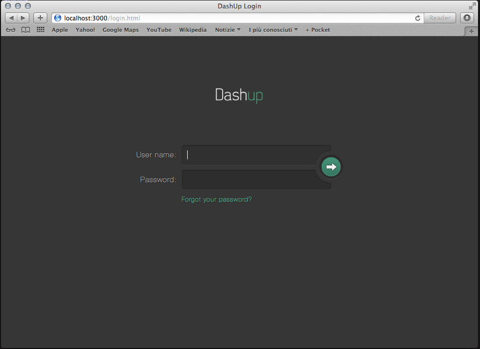

Html5 dashboard with REST API for Application Telemetry.

## Software Stack 

##### Server side: #####
* node.js (http://nodejs.org/) 
* Express (http://expressjs.com/) : used as middleware for web client and REST interface
* socket.io (http://socket.io/) : used for realtime data push
* mongoDB (http://docs.mongodb.org/) : used for persistence
* nconf (https://github.com/flatiron/nconf) : used for application configurations
* jade (http://jade-lang.com/) 
* stylus (http://learnboost.github.io/stylus/)
* moment (http://momentjs.com/)
* https://github.com/rvagg/node-levelup

## Getting started 

##### MongoDB prerequisite #####

* install mongodb (http://www.mongodb.org/)
* create a db directory into the mongodb installation folder (ex: mkdir -p data/db)
* start mondodb service with the command "mongod dbpath data/db" (or any other db folder created above)

##### Web Application #####

* install node.js (http://nodejs.org/) 
* checkout or download the project
* go to the src/web folder and type "npm install -d"
* start the application with the command "node app"
* start the browser at url "http://localhost:3000"
* Login credentials: user=admin , password=* 

## Debugging dashup

To debug the dashp server application you can use "node inspector" (https://github.com/node-inspector/node-inspector)

### Requirements

* [node.js](http://github.com/ry/node)
  - version 0.8 or later
* [npm](http://github.com/isaacs/npm)
* A Blink-based browser (i.e. Google Chrome)

### Install node-inspector

* With [npm](http://github.com/isaacs/npm)

        $ npm install -g node-inspector

### Start debugging
	
	* run dashup application with --debug switch:

		$ node --debug app.js

	* start the inspector. I usually put it in the background

		$ node-inspector &

	* open http://127.0.0.1:8080/debug?port=5858 in Chrome

## Java JMX Proxy 
* todo

## Screenshots 

	

